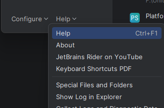
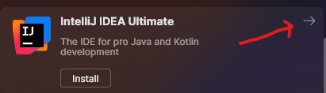
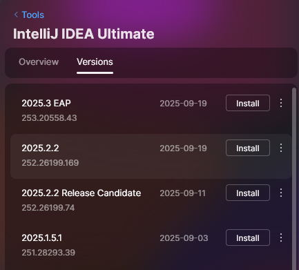
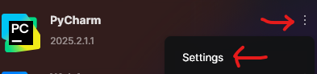

# Remote Dev

**Links**

[Jetbrains - fully offline mode](https://www.jetbrains.com/help/idea/fully-offline-mode.html)

[Jetbrains - Product codes](https://plugins.jetbrains.com/docs/marketplace/product-codes.html)

## Example

Via CLI:

```bash
docker run --rm -v ./output:/home/user/output mercenary9312/jetbrains-clients-downloader --product PY=2025.2.1.1 IU=latest
```

Via Docker Compose:

```bash
docker compose run downlaoder --product PY=2025.2.1.1 IU=latest --filename test.tar.gz
```

## Overview

The `download.sh` script grabs a single product by build number.

Assumption made here is why collect all builds? If in an environment that does not have direct public internet access - you're likely going to need only 1 version until a newer version comes out that's worth upgrading to. (Not saying upgrading isn't worth it, just depends on how much of a pain it is to move things into said environment).

The python script enables a bit more freedom. By using the product code it's able to validate the build number, or grab one based on version, or grab the latest release.

- Can pass in multiple product codes
- By default, the latest build number is automatically fetched
- Can specify version number (2025.2.1.1 - for instance), instead of a build number
  - PY=2025.2.1.1

## How to get build version

- You can query the following, using product code, to obtain a list of build numbers. `https://data.services.jetbrains.com/products?code=PRODUCT_CODE_GOES_HERE`

- You can alternatively open up the IDE you already have installed and open `Help` -> `About` (bottom left - at least in Rider when you're prompted for which project you want to open).




- You can also use Jetbrain's toolbox app. If not installed, an arrow will appear - click on it and you can checkout the versions.





- If you already have an IDE installed, you can click on the 3 dots and look at the about section.



